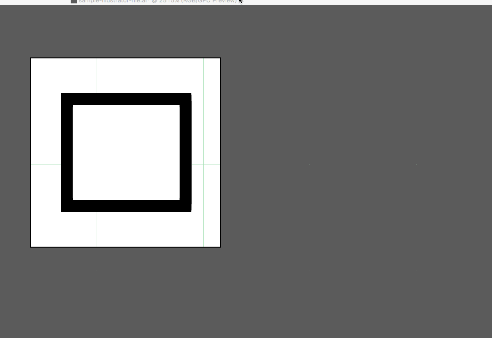
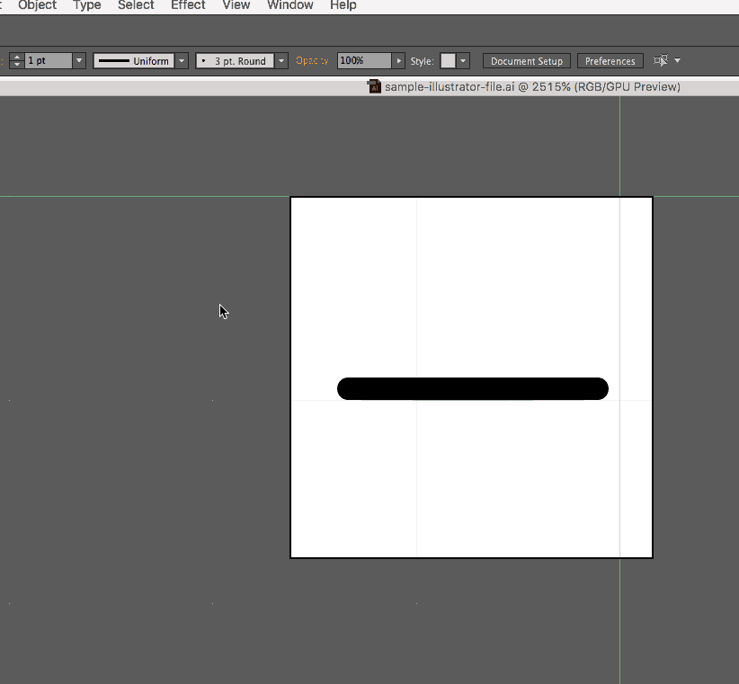

# Firefox SVG Assets
If you'd like to contribute SVG assets to Firefox, this is meant to be a handy guide for making sure you SVGs are compressed and neatly formatted as possible :tada:

## Table of Contents
1. [Explanation of Pixel Grid](#explanation-of-pixel-grid)
2. [Tips for Illustrator SVGs](#tips-for-illustrator-svgs)
3. [Contributing Other Design Workflows](#contributing-other-design-workflows)
4. [Bash Script for Cleaning SVGs](#bash-script-for-cleaning-svgs)
5. [Contributing Code](#contributing-code)

<!--- 5. [Node Script](#node-script) -->
<!--- 6. [Grunt/Gulp Packages](#grunt-gulp-packages) -->

### Explanation of Pixel Grid
Since so many of our SVGs appear so small, designing them on the pixel grid will help them not appear fuzzy when they’re sized down to 16x16 pixels.

For Illustrator you’ll want the following settings:

- **Document settings**: ```Units: pixels```, ```Advanced``` > check ```Align New Objects to Pixel Grid```
- **Transform Panel**: for existing artwork not on pixel grid, select and then within ```Transform``` > ```Advanced``` > check ```Align to Pixel Grid```

You can get a more detailed breakdown with images [here](http://medialoot.com/blog/3-valuable-pixel-perfect-illustrator-techniques/).

You can download a sample Illustrator file [here](README-content/pixel-grid-illustrator.ai).

<!--- You can download a sample Sketch file [here](README-content/pixel-grid-sketch.sketch). -->

### Tips for Illustrator SVGs
When you’re designing your icons in a graphics editor like Adobe Illustrator, there are a lot of things you can do that will bring down the size of the file and make your SVGs easier for the developers to work with. Here are some of them:

- **Expand paths**: Instead of having multiple shapes overlapping each other, expand shapes using the pathfinder.

- Simplify paths (```Object``` > ```Path``` > ```Simplify```)
- Expand objects so that stokes become objects. This has the added benefit of keeping the stroke size intact as the SVG is resized.


#### Devtools-Specific Requests
The devtools panel icons do a couple of things in a specific way; following these guidelines will help stick your patch:

1. **Inline fill colors.** Devtools panel icons all use ```fill=whitesmoke``` in the ```<svg>``` tag.
2. **Inline opacities.** Devtools panel icons also inline opacities on their relevant path.

### Contributing Other Design Workflows
If you’re using a design tool that isn’t listed here and you’d like to add the instructions for how to expand paths, simplify paths, expand strokes, etc., please [open a PR]()! We’d super appreciate it + you’d be the best :100:

<!--- Additionally, please feel free to look through the issues tagged with ```design``` to find known workflows we’d like to add. -->

<!--- If you’ve found an issue with any of the design flows, please let us know by [opening an issue]() and tagging it with a ```design``` label. -->

### Bash Script for Cleaning SVGs (Installation)
The executable for cleaning svgs can be found [here](README-content/clean-svg). Its corresponding header can be found [here](README-content/header.txt).

1. Save both files. [```clean-svg``` executable](README-content/clean-svg) | [```header.txt```](README-content/header.txt)
2. ```npm install -g svgo``` (Installation instructions for Node can be found [here](https://nodejs.org/en/).)
3. Move both the executable and ```header.txt``` to ```usr/local/bin```.
4. Make the bash script executable with ```chmod 755 clean-svg```.

Now you can call ```clean-svg``` from anywhere on your system to clean up SVGs according to the Firefox guidelines.

_Please note_: this script edits the first ```<svg>``` line of the file to have a specific viewport and fill color; locally you might want to change this to fit your needs.

<!--- ### Node Script -->

<!--- ### Gulp/Grunt Packages -->

### Contributing Code
We have a bunch of things we'd like to include for version 1.0; feel free to take a look at [everything in milestone 1](https://github.com/nt1m/firefox-svg-icons/milestones/v1.0) and take a crack at any of them.